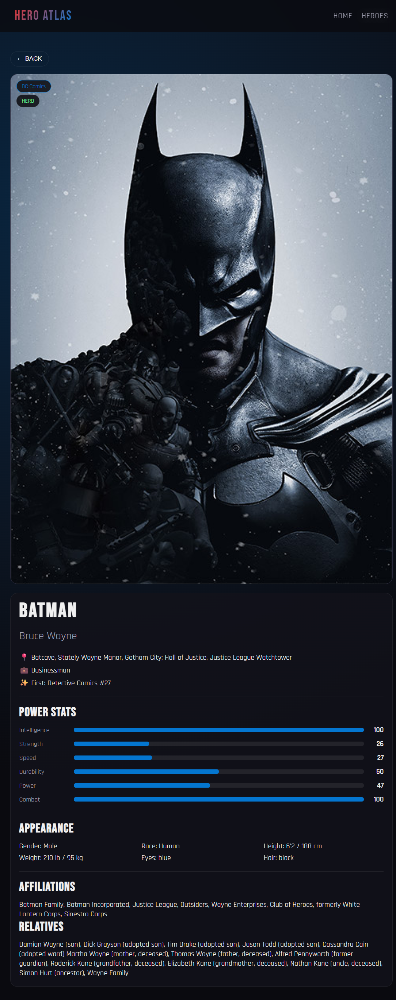
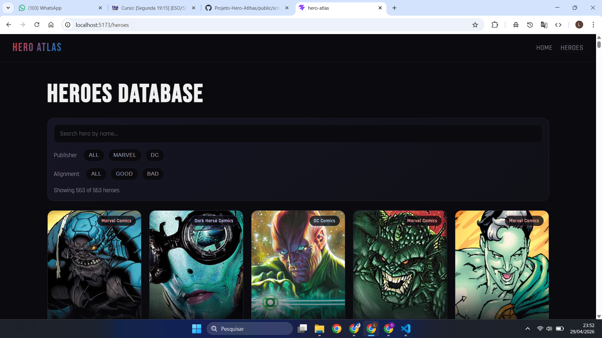
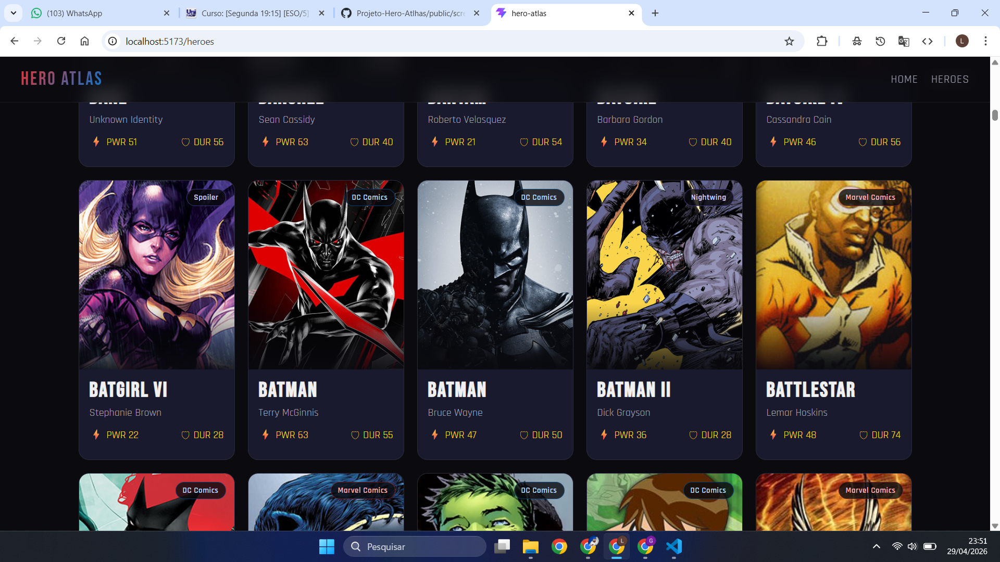
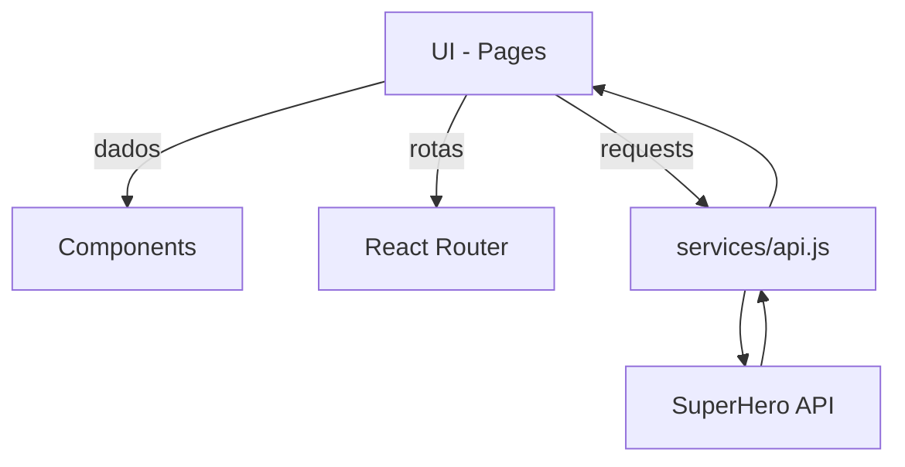

# Hero Atlas 🦸

> Aplicação React para explorar super-heróis da Marvel e DC Universe

## Screenshots





## Arquitetura


## Funcionalidades
- Consumo de API externa e exibição de dados
- Busca e filtros por editora e alinhamento
- Rotas internas com detalhes por herói

## Tecnologias
- React + Vite
- React Router DOM v7
- Axios
- CSS Modules
- SuperHero API (akabab.github.io/superhero-api)

## Como instalar e rodar

```bash
# Clonar o repositório
git clone https://github.com/SEU_USUARIO/hero-atlas.git

# Entrar na pasta
cd hero-atlas

# Instalar dependências
npm install

# Rodar em desenvolvimento
npm run dev

# Build para produção
npm run build
```

## Acesse online
https://luisbarbosaa.github.io/Projeto-Hero-Atlhas/

## Estrutura do projeto

```text
hero-atlas/
├── public/
├── src/
│   ├── assets/
│   ├── components/
│   │   ├── Navbar/
│   │   │   ├── Navbar.jsx
│   │   │   └── Navbar.module.css
│   │   ├── HeroCard/
│   │   │   ├── HeroCard.jsx
│   │   │   └── HeroCard.module.css
│   │   ├── StatBar/
│   │   │   ├── StatBar.jsx
│   │   │   └── StatBar.module.css
│   │   ├── FilterBar/
│   │   │   ├── FilterBar.jsx
│   │   │   └── FilterBar.module.css
│   │   └── Loader/
│   │       ├── Loader.jsx
│   │       └── Loader.module.css
│   ├── pages/
│   │   ├── Home/
│   │   │   ├── Home.jsx
│   │   │   └── Home.module.css
│   │   ├── Heroes/
│   │   │   ├── Heroes.jsx
│   │   │   └── Heroes.module.css
│   │   ├── HeroDetail/
│   │   │   ├── HeroDetail.jsx
│   │   │   └── HeroDetail.module.css
│   │   └── NotFound/
│   │       ├── NotFound.jsx
│   │       └── NotFound.module.css
│   ├── services/
│   │   └── api.js
│   ├── App.jsx
│   ├── App.css
│   ├── index.css
│   └── main.jsx
├── index.html
├── vite.config.js
├── .env
├── vercel.json
└── README.md
```

## Rotas
| Rota | Descrição |
|------|-----------|
| `/` | Home / Landing page |
| `/heroes` | Lista de todos os heróis |
| `/heroes/:id` | Detalhes do herói (rota dinâmica) |
